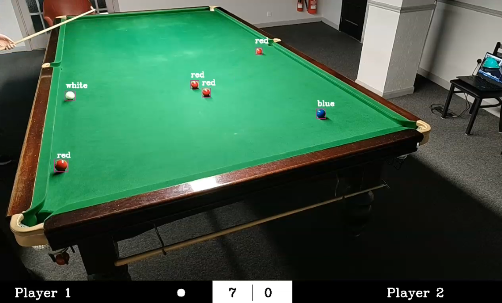

# Snooker-Scoring-System
The Computer Vision snooker scoring system that is being developed for my Dissertation. The aim of the project is to create a program that is capable of scoring a game of snooker using a single camera system in real time.
  
The system uses YOLO to detect the location of the balls on the table, then passes these locations into a custom algorithm that finds the most likely colour of each ball. Once the location and value of each ball is known, each shot is detected when the white ball's location changes, then ball pots for each shot are evaluated by comparing the list of detected balls from before the shot to after the shot.
 

